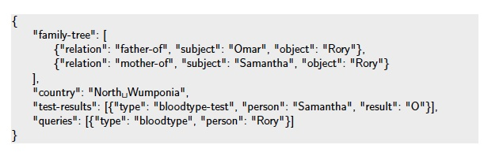
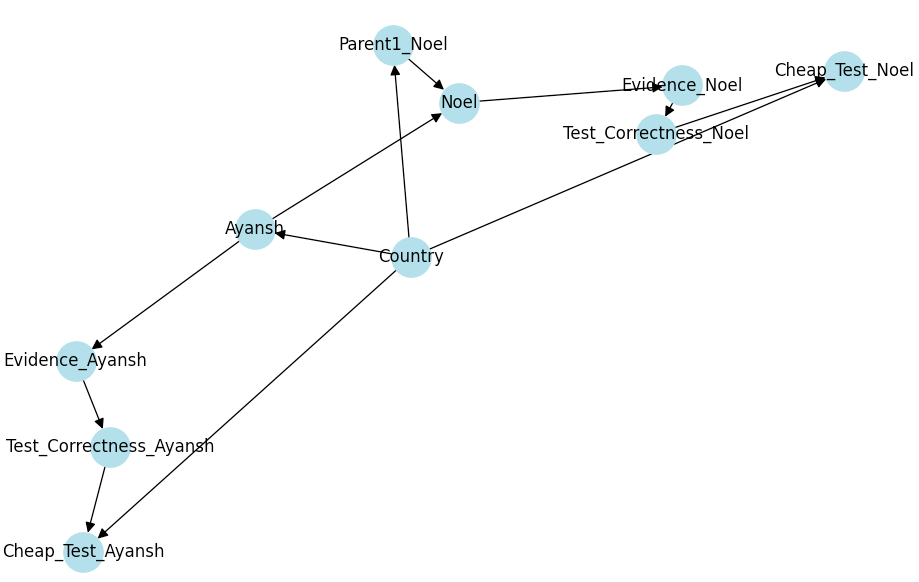

# Compute Blood Types

Using Bayesian networks, compute the probability that someone has a particular blood type
given some test results for the blood types of their relatives.

The family tree is described via relationhips between people. The
following types of relationship are used: mother-of, father-of, sister-of, brother-of. Note that
some relationships may only be implicit. For example, if A is a parent of B, and C is a
sibling of B, then clearly A is also a parent of C – even though it might not be explicitly
stated. We also assume that everyone has exactly one male and one female parent

## Dependencies

Packages to be installed

1. numpy - pip install numpy
2. pgmpy - pip install pgmpy

## Run command

python process.py problem_file_path
If path not specified - Generates solutions for example-problems

## File Structure

1. problems/ - Folders with problems and their solutions
2. conditional_probabilities.py - Calculates conditional probability tables for different nodes on the Network
3. network.py - Contains logic to create the network (build_network function), selecting and adding edges, cpds and parents of corresponding nodes
4. utils.py - Contains some commonly used functions, constant definitions and function to capture relations between different nodes (construct_tree function) - in other words build the family tree
5. process.py - Shell that reads all the json question, build tree, calculate distributions and write the solutions to json file and output it
6. solutions - Generated solutions for questions in problems folder. (solution_check fails in h-00 solution of example problem because of some rounding errors - rest of the solution match)

## Solution

### Building Relationships (Family) Tree

construct_tree method in utils.py
We keep an object collection for each node that stores its parent, siblings, children and name, in following format

{'name': subject, 'children': [], 'parents': [], 'siblings': []}

We do couple of logics to accommodate when we get a sibling relation.
This helps in inferring relationships without explicitly given in the data.

1. We copy parent across siblings
2. We copy existing siblings across new siblings
3. We copy children for parents of siblings

When a person has no parent but share siblings, we add twp fake parents for both to connect them.
When a person has only a single parent given, we add one fake parent to connect its siblings.
These parents are then added as nodes and edges to the Network. (Parent_1{name} in the below network)

### Building Bayesian Network

In files network.py and conditional_probabilities.py

Here is a simple Bayesian network build with 2 persons  

        {
            "relation": "father-of",
            "subject": "Ayansh",
            "object": "Noel"
        }

We define that each person can have 6 types of Blood groups (OO, AO, AA, BO, BB, AB)
And the real number of Blood groups are [O, A, B, AB]

#### Types of Nodes in the Network

1. Country Node - Formatted as "Country"  
   One single node top most node. Connected to all parent nodes (nodes without any parent)It has two values which are equally likely hence has a prior [0.5, 0.5].

2. Parent Nodes - This is the second top most node.
   If the Person is a parent without any parent it is only dependent on the Country node to have their distributions same as the population distribution

3. Person Nodes - Formatted as "Person Name" 
   A node for each Person in the family tree denoted with person name. They are conditionally dependent on two of their parents . Hence Their cps are 6 \*36 .

4. Evidence Nodes - Formatted as - "Evidence\_{person}" 
   Attached to each person node (Here Evidence_Ayansh). This maps the 6 Blood groups to the 4 actual one's that we need to find the probability for. Its cpds are 4 \* 6 with AO,AA - mapping to A and BO, BB - mapping to B

#### To handle cheap test results

5. Test correctness nodes - Formatted as - "Test*Correctness*{person}"  
   It has 5 values [O_T, A_T, B_T, AB_T, False]. O_T defines that test that returned O is true. False - Refers that the cheap test returns false results. It is dependent on the Evidence nodes. The cpd is of dimension 5\* 4 with false probabilities 0.3 and True Probabilities 0.7

6. Cheap test node - Formatted as - "Cheap*Test*{person}"  
   It is conditionally dependent on the Test correctness node - If the test is correct we get the correct class in the test, if not the distribution of the particular blood group is the population distribution. Hence it also need the country node as its parent to determine which population density False should take. Its cpd is 4 * (2*5) - 2 countries and 5 Test correctness node.

### Evidence

The test results are evidences in our network

1. bloodtype-test
   We set the evidence node of the corresponding person to the correct value "Evidence\_${person}"
2. cheap-bloodtype-test
   We set the Cheap test node of the corresponding person to the correct value "Cheap*Test*{person}"

### Query

The query is again constructed using the simplified evidence node using queries attribute of the data.
When we get query for a person name, we set the query variable as "Evidence\_${person}"
